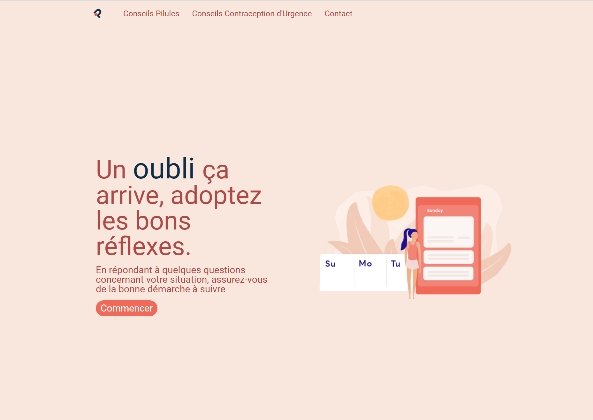


[![Contributors][contributors-shield]][contributors-url] [![Forks][forks-shield]][forks-url] [![Stargazers][stars-shield]][stars-url] [![Issues][issues-shield]][issues-url]

# OupsMyPill : Gestion d'oubli de pilule contraceptive

## 🔨 Technologies 

* Frontend 
    - Framework **Angular**
    - **SCSS**
    - angular-calendar (+ bootstrap )

## 🔧 Installation

   ### 🔍 Frontend
This project was generated with Angular CLI version 13.3.5.

- `npm install`
- Run `ng serve` for a dev server. Navigate to http://localhost:4200/ . The app will automatically reload if you change any of the source files.

   ### 🔍 Backend
clone this repo : https://github.com/jpcouhe/oupsMyPill--backend

- `npm install`
- Run `npm start`
    => Navigate to http://localhost:3000/pilules

## 🎯 Fonctionnalités

   - Prise d'information du contexte via un formulaire 
   - Intégration dans un calendrier via angular-calendar (package qui utilise BootStrap) 
   - Schéma adapté en fonction de la pilule 
   
<a href='https://youtu.be/RUdAbk6bczE](https://youtu.be/fDQeO86erf4'> 

## 🏗️ Concepts utilisés
  - Récupération de la liste de toutes les pilules existantes 
  - Observables et librairie RxJs
  - Utilisation d'un package npm 

## 🚀 Optimisations supplémentaires envisageables  
  - Meilleurs gestions des erreurs 
  - Création des pages conseils 
  - Intégration de test unitaire 
  - Rendre calendrier responsive
  
## 📬 Contact 

COUHE Jean-philippe - pro@jean-philippecouhe.fr

 
 
 ## 👏 Remerciement
 
 Image : https://dribbble.com/shots/14103255--Routine-Illustration
 
 
<!-- MARKDOWN LINKS & IMAGES -->
<!-- https://www.markdownguide.org/basic-syntax/#reference-style-links -->
[contributors-shield]: https://img.shields.io/github/contributors/jpcouhe/LaPanthere---Optimisation-SEO.svg?style=flat-square
[contributors-url]: https://github.com/jpcouhe/LaPanthere---Optimisation-SEO/graphs/contributors
[forks-shield]: https://img.shields.io/github/forks/jpcouhe/LaPanthere---Optimisation-SEO.svg?style=flat-square
[forks-url]: https://github.com/jpcouhe/LaPanthere---Optimisation-SEO/network/members
[stars-shield]: https://img.shields.io/github/stars/jpcouhe/LaPanthere---Optimisation-SEO.svg?style=flat-square
[stars-url]: https://github.com/jpcouhe/LaPanthere---Optimisation-SEO/stargazers
[issues-shield]: https://img.shields.io/github/issues/jpcouhe/LaPanthere---Optimisation-SEO.svg?style=flat-square
[issues-url]: https://github.com/jpcouhe/LaPanthere---Optimisation-SEO/issues
[license-shield]: https://img.shields.io/github/license/jpcouhe/LaPanthere---Optimisation-SEO.svg?style=flat-square
[license-url]: https://github.com/jpcouhe/readme-template-/blob/master/LICENSE.txt
[linkedin-shield]: https://img.shields.io/badge/-LinkedIn-black.svg?style=flat-square&logo=linkedin&colorB=555
[linkedin-url]: https://linkedin.com/in/othneildrew
[product-screenshot]: example.jpg
[youtube-screenshot]: youtube.png
